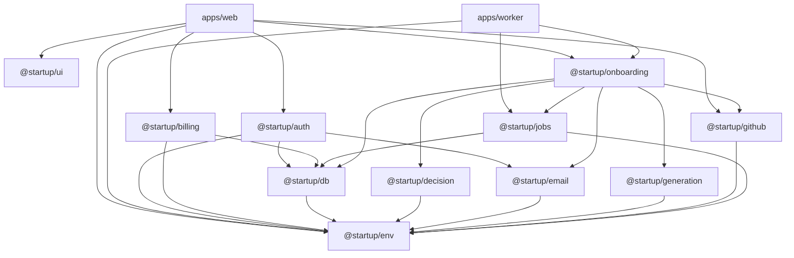

# Package Boundaries

## Applications

`apps/` contains deployable applications:

- `apps/web` (`@startup/web`): the Next.js application.
- `apps/worker` (`@startup/worker`): the background worker that runs repository analyses. It depends on `@startup/env`, `@startup/jobs`, and `@startup/onboarding`. See `deployment.md`.

Applications may depend on packages.

Packages must not depend on applications.

## Packages

`packages/` contains reusable capabilities and shared infrastructure.

Packages should expose intentional public APIs rather than requiring consumers to import arbitrary internal files.

## Dependency Direction

Allowed:

packages → external dependencies

apps → packages → external dependencies

Not allowed:

packages → apps

## Dependency Graph

Arrows point from a package to what it depends on. Every package also uses `@startup/typescript-config`, which is left out to keep the graph readable.

## Current Packages

### @startup/typescript-config

Shared TypeScript configuration for the repository.

This package contains configuration only and must not contain application runtime code.

### @startup/ui

Shared React UI components and design-system primitives.

Applications may depend on this package.

The package must not depend on application code.

Consumers should import from the package's public API rather than internal source paths.

Shared UI primitives belong here when they are reusable across application surfaces.

### @startup/env

Validated environment configuration.

- `@startup/env` exports server-only configuration (`serverEnv`).
- `@startup/env/client` exports browser-safe `NEXT_PUBLIC_*` configuration (`clientEnv`) and must not import server configuration.

See `environment.md`.

### @startup/db

PostgreSQL access through Drizzle ORM: the shared connection (`db`) and schema.

Server-only. Depends on `@startup/env`.

See `database.md`.

### @startup/auth

Better Auth configuration.

- `@startup/auth` exports the server auth instance and is server-only.
- `@startup/auth/client` exports the browser-safe auth client.
- `@startup/auth/next` exports the server-only Next.js route handler (`authHandler`) and `getSession()`.
- `@startup/auth/redact` exports `scrubAuthTokens`, which removes authentication tokens from data before it is sent to observability systems. It is browser-safe and has no imports.
- `@startup/auth/redirect` exports `safeRedirectPath`, the rule for redirects after sign-in and sign-up. It is browser-safe and has no imports.

Depends on `@startup/db`, `@startup/email`, and `@startup/env`. Takes `next` as a peer dependency for `after()`.

See `authentication.md`.

### @startup/billing

Server-side Stripe integration: customer mapping, checkout, webhook verification, and subscription synchronization.

Server-only. Owns the `stripe` dependency. Depends on `@startup/db` and `@startup/env`.

See `billing.md`.

### @startup/decision

Bounded AI decisions (classification, routing, scoring, gating) through TypeSafe's System One API: `createDecisionClient`, typed questions and answers, and `Decision*` errors.

Server-only. Depends on `@startup/env`. The only code that calls the TypeSafe API. `@startup/onboarding` uses it to rank files.

See `decision-models.md`.

### @startup/email

Transactional email over SMTP: `sendEmail`, `createEmailSender`, typed message templates, and `Email*` errors.

Server-only. Owns the `nodemailer` dependency. Depends on `@startup/env`. The only code that opens an SMTP connection.

See `email.md`.

### @startup/generation

Open-ended generation with Claude through the Anthropic API: `createGenerationClient`, `generateObject` for structured output, `isGenerationConfigured`, and `Generation*` errors. Product prompts belong to the caller.

Server-only. Owns the `@anthropic-ai/sdk` dependency and is the only code that calls the Anthropic API. Depends on `@startup/env`. `@startup/onboarding` uses it to write walkthroughs.

See `generative-models.md`.

### @startup/github

Public GitHub repositories through the REST API: repository metadata, branch heads, file listings, single files, and files read from the repository's archive, with typed `GitHub*` errors.

- `@startup/github` is server-only. It is the only code that calls GitHub, and it owns the `tar-stream` dependency.
- `@startup/github/url` exports `parseRepositoryUrl`, the rule for repository URLs that users submit. It is browser-safe and has no imports.

Depends on `@startup/env`. `@startup/onboarding` uses it. `apps/web` uses `./url` to check URLs in the add form.

See `repository-analysis.md`.

### @startup/jobs

Background jobs in PostgreSQL through pg-boss: producer and worker queues, the queue registry (`QUEUES`), sending inside a Drizzle transaction (`inTransaction`), the `jobs:migrate` release step, and `JobQueueUnavailableError`.

- `@startup/jobs` is server-only. It owns the `pg-boss` dependency and is the only code that imports it.
- `@startup/jobs/testing` exports `createTestJobQueue()`, `createTestJobQueueTemplate()`, and `TestClock` for tests: pg-boss on in-memory PGlite.

Depends on `@startup/db` and `@startup/env`. `apps/worker` and `@startup/onboarding` use it.

See `jobs.md`.

### @startup/onboarding

The product's repositories and their analysis.

- `@startup/onboarding` (server-only): adding, listing, reading, retrying, and deleting repositories, the per-user limits, and queueing their analyses. `addRepository`, `retryAnalysis`, `deleteRepository`, `listRepositories`, `getRepository`, `getAddStatus`, `RepositoryRequestError`, and `RepositoryNotFoundError`.
- `@startup/onboarding/worker` (server-only): `startAnalysisWorker`, the analysis and its job handlers.
- `@startup/onboarding/walkthrough`: the stored walkthrough document's schema, `parseWalkthroughDocument`, and `githubUrl`. Imports only `zod`.

Depends on `@startup/db`, `@startup/decision`, `@startup/email`, `@startup/generation`, `@startup/github`, and `@startup/jobs`. `apps/web` uses `.` and `./walkthrough` in the repository pages and routes, and `apps/worker` uses `./worker`.

See `repository-analysis.md`.
