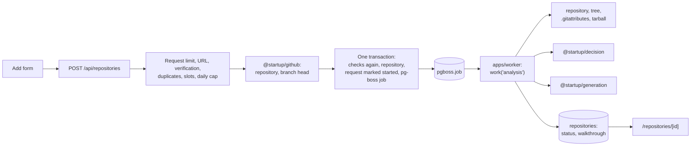

# Repo Onboarding Core

## Goal

Implement `docs/specs/repo-onboarding-core.md`:

- a signed-in, verified user adds a public GitHub repository by URL
- a background worker re-checks that the repository is public, lists its files, drops the ones that never matter, chooses up to 300, ranks them with `@startup/decision` (or local signals), and has Claude write a four-section walkthrough (or builds the basic walkthrough without a key)
- the user sees each repository's status and walkthrough on two pages
- the server enforces the limits: 5 repositories per user, 10 analyses started per user per 24 hours, 20 add or retry requests per user per hour, 300 scored files per repository, and one running analysis per user

The work is split into slices. Each slice passes `pnpm verify` on its own and can be reviewed and merged separately.

Status: planned and reviewed. Nothing is implemented. Review Changes lists what the review changed.

## Decisions

Agreed during planning and review. Change them here before implementing, not during.

| Decision | Choice | Reason |
| --- | --- | --- |
| Job queue | pg-boss 12, owned by a new `@startup/jobs` package | Tested Postgres queue: `SKIP LOCKED` claims, heartbeats, retries, dead letters, cron, and per-group concurrency. Replaces a hand-written claim, lease, and sweep. `packages/auth/src/background.ts` already anticipates a jobs package. |
| pg-boss schema and queues | `pnpm db:migrate` runs the Drizzle migrations, then `jobs:migrate`: the pinned pg-boss CLI migrates the `pgboss` schema, then the queues are created or updated. Application processes run with `migrate: false`. | `deployment.md`: the application never migrates the database when it starts. pg-boss SQL cannot run inside `drizzle-kit migrate`: it brings its own `BEGIN`/`COMMIT`, and upgrades can use `CREATE INDEX CONCURRENTLY`. `send` fails when its queue does not exist, so queues must exist before any web process sends. |
| Queue definitions | Kept in `@startup/jobs` (`src/queues.ts`), like table definitions in `@startup/db`. | `jobs:migrate` creates them without depending on a product package. |
| pg-boss upgrades | Exact version pin, its own Dependabot pull request, and a release procedure: stop the worker, run `pnpm db:migrate`, deploy the web app and the worker. | With `migrate: false`, start-up fails on any schema version mismatch, in either direction (`contractor.js` `check()`). Old processes cannot start after the migration, and new ones cannot start before it. pg-boss minor releases change the schema (12.35.1 is schema version 43). |
| Producer | Web processes start one pg-boss instance lazily (`max: 2`, no supervision, no scheduling). If it cannot start, add and retry return `503 QUEUE_UNAVAILABLE`. | `send` needs a started instance: it reads the queue cache that `start()` loads. |
| Concurrency | `localConcurrency: 4` per worker process and `groupConcurrency: 1` with the user ID as the group. The handler also enforces one running analysis per user: under a lock on the user's row it checks for another `running` repository, and if one exists it re-queues itself 15 seconds later. | Spec: a user's analyses run one at a time. pg-boss's group check is best effort: two fetches at the same moment can claim two jobs from one group. |
| Enqueueing | The job is sent inside the same Drizzle transaction that saves the repository and marks the request as started (`fromDrizzle`). The job ID is generated first and stored on the repository. | A repository never exists without its job, and a rolled-back request leaves no job. |
| Interruptions | Every interruption counts, a deploy included. A crash or lost heartbeat: pg-boss retries once (`retryLimit: 1`), then the dead-letter queue marks the repository failed. On SIGTERM the worker stops claiming, aborts its handlers so each throws `AnalysisInterruptedError` and pg-boss fails the job into its retry, marks those repositories `queued`, then calls `stop()`. | Spec: an interrupted analysis starts over once, then fails. `stop()` alone fails running jobs before it aborts their handlers, so the handlers would keep writing. |
| Write guard | Every worker write matches `job_id` and `job_attempt` (pg-boss's `retryCount`). | A retry keeps the job ID. Without the attempt, a stale run could overwrite its retry. |
| Expected failures | Not found or private, too large, nothing to analyze, rate limit exhausted, writer failed, and timed out mark the repository failed and complete the job normally. | Only unexpected errors are retried. |
| Errors stored by pg-boss | Handlers return nothing and throw only sanitized errors: a type and a step, no message from GitHub, TypeSafe, Anthropic, or file contents. | pg-boss stores thrown errors with their properties in `pgboss.job.output`, and dead-lettering copies them. Spec: no file contents in the database. |
| Time budget | 15 minutes per analysis. Scoring stops at 6 minutes, or after 5 TypeSafe timeouts or provider errors in a row, and the rest fall back to local signals. The writer gets the remaining time minus 1 minute through its `AbortSignal`, and a re-request happens only when 3 minutes remain. `expireInSeconds` (16 minutes) is a backstop. | 300 files at 4 at a time with TypeSafe's 10-second timeout can take 12.5 minutes, and the SDK retries timeouts. |
| Running the worker | A new deployable, `apps/worker`, run with `tsx`. Start-up retries every 5 seconds while the database is unreachable or pg-boss is not migrated, with a log line saying which. | Workspace packages ship TypeScript with extensionless imports, which plain `node` cannot run. Turbo stops every `pnpm dev` task when one exits. |
| GitHub access | Two calls when adding (repository, branch head). Four in the worker: the repository again (visibility), the recursive tree, the root `.gitattributes`, and the tarball, streamed and read with `tar-stream`. | Spec: visibility is checked again when each analysis starts. Fetching 300 files one by one would use the whole unauthenticated limit (60 calls per hour) in one analysis. GitHub tarballs store long paths in pax headers. |
| Order of checks when adding | Request limit, URL, verification, then duplicates (by the parsed name), slots, and the daily cap from cheap reads, then GitHub, then all of them again inside the transaction. | A rejected request must not spend the shared GitHub quota. |
| Request limit | 20 add or retry requests per user per rolling hour, counting rejected ones, in an `analysis_requests` table that also records which requests started an analysis. | Spec. One table serves both the hourly limit and the daily cap. |
| GitHub for tests | `GITHUB_API_URL`, default `https://api.github.com`. Plain HTTP only for a loopback host. | End-to-end tests point the web app and the worker at a local GitHub stub. Recorded in the spec. |
| Writer | `@anthropic-ai/sdk` in a new `@startup/generation` package: streaming with `finalMessage()`, structured output through `output_config.format` and `zodOutputFormat`, effort `high` set explicitly, and the server-side refusal fallback (`fallbacks: "default"`, beta `server-side-fallback-2026-07-01`). No prompt caching. The model is configuration. The recommended value is `claude-opus-5-5`. | Anthropic's guidance for the recommended model. Repositories of security tools can trigger refusals. Each prompt is sent once, so caching would only add the cost of a cache write. The SDK's zod helper accepts zod 4. |
| No quoted code | The output schema bounds every field, prose strings may not contain line breaks or code fences, and backtick spans longer than 80 characters render as plain text. The prompt asks for every file and directory in backticks. | Spec: the walkthrough never quotes code, and every named file links to GitHub. |
| Rendering | The walkthrough is stored as structured JSON: text segments and path references. Pages render React text nodes and links built from the references. No markdown library, no `dangerouslySetInnerHTML`, no images. | Model output and repository text are untrusted. |
| Observability | The worker reports errors only: tracing off, breadcrumbs dropped, the web app's `dataCollection` settings plus `stackFrameVariables: false`. The repository pages carry `ph-no-capture`, and their titles never contain repository names. | Sentry 11 collects AI inputs and outputs, request and response bodies, and stack-frame variables by default (`@sentry/core` `resolveDataCollectionOptions.js`). posthog-js autocapture and session replay are on and do not mask text. |
| Requests | Route handlers, following the billing routes and the `add-api-route` skill. State-changing routes check that `Origin` matches `BETTER_AUTH_URL`. `[id]` must be a UUID, or the response is `404`. Status updates use `router.refresh()` on both pages. | Existing pattern. Route handlers do not get the Origin check that Server Actions get. A malformed ID would otherwise be a Postgres error and a `500`. |
| Stuck analyses | An hourly maintenance job fails repositories that have been `queued` or `running` for over 20 minutes and whose job is missing or finished. Queue retention is 30 days. | pg-boss deletes jobs that wait past their retention. A repository must never stay queued or running forever. |
| Default redirect | `DEFAULT_REDIRECT` in `@startup/auth/redirect` becomes `/repositories`. | Spec. Changes the auth pages' decision, which is updated in the same slice. |

Constants chosen by this plan, kept in `packages/onboarding/src/limits.ts` and tunable:

| Constant | Value |
| --- | --- |
| Largest file kept | 100 KB |
| Files scored | 300, from a candidate pool of 450 |
| Content sent to TypeSafe per file | first 16 KB |
| Largest download | 250 MB compressed |
| TypeSafe requests at once, per analysis | 4 |
| Scoring deadline | 6 minutes, or 5 failures in a row |
| Role confidence below which the path rule is used | 0.6 |
| Files sent to the writer | top 30, at most 30 KB each and 300 KB in total |
| Paths in the outline sent to the writer | 2,000 |
| Key files | up to 15 |
| Analysis time limit | 15 minutes |
| Heartbeat | every 15 seconds, expected every 30 |
| Re-queue delay for a user's second analysis | 15 seconds |
| Re-queues for GitHub rate limits | 3 |

## Open Questions

- The spec's Security section says "The application only contacts GitHub, TypeSafe, and Anthropic." It also contacts Sentry, PostHog, and the SMTP server. Suggested wording: "Analysis code only contacts GitHub, TypeSafe, and Anthropic." The spec is unchanged until this is agreed.

## Existing System

- `apps/web` is the only deployable: Next.js 16.3 App Router with the React compiler. Pages are server components that call `getSession()` from `@startup/auth/next`. Forms are client components. Route handlers are thin and delegate to packages (`add-api-route`). `apps/web/AGENTS.md` requires reading the Next.js guides in `node_modules/next/dist/docs/` before writing code. `notFound()` returns `404` only for responses that are not streamed, so the `[id]` page must not add `loading.tsx`.
- Workspace packages ship TypeScript source with no build step. Tests use Vitest. `@startup/billing` and `@startup/auth` run in-memory PGlite with the repository migrations applied (`packages/billing/src/testing/database.ts`). `@startup/email` and `@startup/auth` load a setup file that fails any test that opens a connection. The last migration is `0004`.
- `@startup/decision` is the TypeSafe client: injectable `fetch`, typed `Decision*` errors, no retries, lazy configuration errors, a 10-second default timeout. No application uses it yet.
- `@startup/env` validates server variables in one zod schema. `optional()` treats an empty value as unset. `SMTP_URL` and `EMAIL_FROM` are a pair checked in `superRefine`. `serverEnv` parses at import and requires `DATABASE_URL`, `BETTER_AUTH_SECRET`, and `BETTER_AUTH_URL`.
- `@startup/email` exports `isEmailConfigured()`. Verification state is `session.user.emailVerified`.
- `packages/auth/src/email-rate-limit.ts` is the pattern for limits counted in Postgres.
- The only background mechanism is `runAfterResponse` (`after()`), which ends with the request.
- `next.config.ts` loads the root `.env.local` with `process.loadEnvFile`, which never replaces a variable that is already set, including an empty one.
- `apps/web/sentry.server.config.ts` restricts `dataCollection` and scrubs events. `apps/web/src/instrumentation-client.ts` starts PostHog with autocapture and session replay on.
- `@startup/auth/redirect` sets `DEFAULT_REDIRECT = "/account"`. `packages/auth/src/redirect.test.ts` asserts it. In `tests/e2e/auth-pages.spec.ts`, the `signUp` helper waits for `/account`, several tests then use controls that exist only on the account page (verification status, resend, sign-out), and the redirect fallback cases expect `/account`.
- Playwright 1.63 starts the observability stub (`127.0.0.1:9999`) and `next start` (`127.0.0.1:3000`), and merges `webServer.env` over `process.env`. `webServer.wait.stdout` can wait for a log line. Tests read what the stub received with `observabilityReceived()`. The CI E2E job has Postgres and Mailpit, runs `pnpm db:migrate`, and uses no secrets. The Verify job has no database.
- pnpm enforces a minimum release age. The transactional email work pinned an older `nodemailer` rather than adding `minimumReleaseAgeExclude`.
- The lockfile has `tsx` 4.23.15, `zod` 4, `@sentry/node` 11.0.0 (through `@sentry/nextjs`), and PGlite 0.5.8. It has no pg-boss, Anthropic SDK, or tar library.

## Flow



## Slices

Each slice lists its files, tests, skill, and verification. Every slice runs `pnpm verify`.

### Slice 0: Amend the Spec (done)

- `docs/specs/repo-onboarding-core.md`:
  - Limits: "A user's analyses run one at a time. The others wait as `queued`."
  - Decisions, Adding a Repository, Limits, Retry, Security, Acceptance Criteria: 20 add or retry requests per user per hour.
  - Configuration: a fourth variable, `GITHUB_API_URL`. The token must not have access to private repositories.
  - Dropped Files: only the root `.gitattributes`. At most 450 candidates are read.
  - Security: visibility is checked again when each analysis starts. Sentry's other data and PostHog autocapture and replay are covered. Storage includes the job queue's records.
  - Acceptance Criteria: the request limit, a repository made private while queued, no file contents after a failed run, nothing sent to Sentry or PostHog during an E2E run.

Verification: `pnpm agent:check`.

### Slice 1: Schema

| File | Change |
| --- | --- |
| `packages/db/src/schema/onboarding.ts` (new) | `repositories` and `analysis_requests`, with relations to `user`. Columns in Data and API Changes. |
| `packages/db/src/schema/index.ts` | Export both tables and their relations. |
| `packages/db/drizzle/0005_*.sql`, `packages/db/drizzle/meta/*` | Generated by `pnpm db:generate`. Must contain only `CREATE TABLE`, indexes, foreign keys, and checks. |
| `docs/architecture/database.md` | Where the onboarding tables are defined. |

- Tests: the existing PGlite suites in `@startup/billing` and `@startup/auth` apply the new migration.
- Skill: `database-migration`.
- Verification: `pnpm db:generate`, read the SQL, `pnpm db:migrate`, `pnpm verify`.

### Slice 2: Job Queue (`@startup/jobs`)

| File | Change |
| --- | --- |
| `packages/jobs/package.json`, `tsconfig.json`, `vitest.config.ts` (new) | `@startup/jobs`, entry points `.` and `./testing`. `pg-boss` pinned exactly: the newest release older than pnpm's minimum release age. Depends on `@startup/db` and `@startup/env`. Dev: PGlite, `drizzle-orm`, and `tsx`. `@startup/db`'s `pg` range moves to `^8.23.1`, the version pg-boss requires, so the workspace keeps one `pg` and one `drizzle-orm` variant. Scripts: `typecheck`, `test`, `jobs:migrate`, `jobs:plans`. Tests load a no-network setup file, as in `@startup/email`. |
| `packages/jobs/src/queues.ts` | The queue registry: `analysis-failed` (dead letter), `analysis` (`retryLimit: 1`, `retryDelay: 0`, `heartbeatSeconds: 30`, `expireInSeconds: 960`, `retentionSeconds` 30 days, dead letter `analysis-failed`), and `onboarding-maintenance`. Dead-letter queues are listed first. |
| `packages/jobs/src/queue.ts` | `createJobQueue(role)` and `startJobQueue(queue)`: a `PgBoss` that is always `migrate: false`; a failed start raises `JobQueueUnavailableError` (`not_installed`, `migration_required`, `unreachable`, never the underlying error) and stops the instance. `producer`: `max: 2`, `supervise: false`, `schedule: false`. `worker`: supervision and scheduling on. `getJobQueue()`: the process's producer, started on first use and kept on `globalThis` (Next.js bundles instrumentation and routes separately, as in `packages/auth/src/report.ts`); a failed start is not kept. `useListenNotify` off, because it does not work through transaction-mode poolers. `setJobQueueErrorReporter` routes pg-boss's background errors. |
| `packages/jobs/src/transaction.ts` | `inTransaction(tx)`: wraps a Drizzle transaction with `fromDrizzle(tx, sql)`, using `sql` from `@startup/db`. |
| `packages/jobs/src/migrate.ts` | Release script. Resolves `DATABASE_URL` the way `packages/db/drizzle.config.ts` does (shell, then the root `.env.local`). Runs the pinned `pg-boss migrate` with `PGBOSS_DATABASE_URL` in the child environment only, never on the command line and never printed. Then starts an instance and creates every queue in `queues.ts`, updating options on queues that already exist (`createQueue` does nothing when the queue exists). `jobs:plans` prints the pending SQL with `pg-boss plans migrate --dry-run` for review. |
| `packages/jobs/src/testing/queue.ts` | Test helper: PGlite with the repository migrations, the pg-boss schema installed through `fromPglite` with `migrate: true` and `backend: 'pglite'` (tests only), the queues created, then a fresh instance started so its queue cache is loaded. Without that order, a `send` inside a Drizzle transaction waits forever behind PGlite's single connection. Also `TestClock` and job spies. |
| `packages/jobs/src/queue.test.ts` | See Tests. |
| `package.json` (root) | `db:migrate` runs the Drizzle migrations, then `jobs:migrate`. |
| `.github/dependabot.yml` | Exclude `pg-boss` from the grouped minor and patch update. State why next to the rule. |
| `docs/architecture/jobs.md` (new) | The queue registry, producer and worker roles, the schema and its release step, the upgrade procedure, connection pools, stored errors, and testing. |
| `docs/architecture/database.md`, `deployment.md` | The `pgboss` schema is tool-managed and migrated by `pnpm db:migrate`, never at start-up. The pg-boss upgrade procedure in the release checklist. |
| `docs/architecture/dependencies.md` | `pg-boss`: single owner `@startup/jobs`, exact pin, upgrades are schema changes. |
| `docs/architecture/package-boundaries.md` | The package and the graph. |
| `docs/template-checklist.md` | The pg-boss upgrade procedure. |
| `.agents/skills/database-migration/SKILL.md` | The `pgboss` schema does not go through Drizzle. Review its SQL with `jobs:plans`. |
| `AGENTS.md`, `.agents/rules/repository.md` | Jobs section: only `@startup/jobs` imports `pg-boss`. Applications never migrate pg-boss at start-up. Job handlers return nothing and throw only sanitized errors. |
| `README.md` | Existing checkouts run `pnpm db:migrate` again after pulling this slice. |

- Verify while implementing: `fromDrizzle` with `drizzle-orm` 0.45 transactions for node-postgres and PGlite; `updateQueue` for option changes; how pg-boss looks up a job by ID.
- Skill: `add-package`.
- Verification: `pnpm --filter @startup/jobs test`, `pnpm db:migrate` run twice (the second changes nothing), `pnpm verify`.

### Slice 3: GitHub Access (`@startup/github`)

| File | Change |
| --- | --- |
| `packages/github/package.json` etc. (new) | `@startup/github`, entry points `.` (server-only) and `./url` (no imports, browser-safe). Depends on `@startup/env`, `tar-stream`, and `zod`. Tests load the no-network setup file. |
| `packages/github/src/url.ts` | `parseRepositoryUrl(input)`: the spec's accepted forms, GitHub's owner and repository name rules, `{ owner, name }` or `null`. |
| `packages/github/src/client.ts` | `createGitHubClient({ token?, apiUrl?, fetch? })`, defaults from `serverEnv`: `getRepository` (canonical name, description, default branch, visibility; private raises the same error as missing), `getBranchHead` (409 is an empty repository), `getTree` (recursive; `truncated` raises too large), `readFile` (root `.gitattributes`), and `readFiles(sha, paths, { maxDownloadBytes, maxFileBytes, signal })`. |
| `packages/github/src/archive.ts` | Streams `/tarball/{sha}` through `node:zlib` and `tar-stream`, strips GitHub's top-level directory, keeps only requested paths, and stops past the download cap. |
| `packages/github/src/errors.ts` | `GitHubNotFoundError`, `GitHubEmptyRepositoryError`, `GitHubRepositoryTooLargeError`, `GitHubRateLimitError` (with the reset time), `GitHubUnavailableError`. Messages never contain the token, headers, or response bodies. |
| `packages/env/src/server.ts`, `server.test.ts` | `GITHUB_API_TOKEN` (optional, secret) and `GITHUB_API_URL` (optional URL; `http:` only for `127.0.0.1` or `localhost`). |
| `.env.example` | GitHub section: both empty, why the token matters in production, that it must have no access to private repositories, and that `GITHUB_API_URL` is for tests. |
| `docs/architecture/repository-analysis.md` (new) | GitHub Access: calls per analysis, rate limits, redirects, the token. Later slices add the rest. |
| `docs/architecture/environment.md`, `dependencies.md`, `package-boundaries.md` | Variables, `tar-stream`'s single owner, the package. |
| `docs/template-checklist.md` | Set `GITHUB_API_TOKEN` before production, with public-repository read access only. |
| `.agents/rules/repository.md`, `AGENTS.md` | Only `@startup/github` calls GitHub. |

- Redirects are followed by hand, only to `codeload.github.com` or the configured API origin. The token is sent only to the API origin.
- Skills: `add-package`, `add-environment-variable`.
- Verification: `pnpm --filter @startup/github test`, `pnpm --filter @startup/env test`, `pnpm verify`.

### Slice 4: Writer Model (`@startup/generation`)

Read the `claude-api` skill's TypeScript files before writing this package.

| File | Change |
| --- | --- |
| `packages/generation/package.json` etc. (new) | `@startup/generation`, entry point `.`. Depends on `@startup/env`, `@anthropic-ai/sdk` (pinned past the minimum release age), and `zod`. Tests load the no-network setup file. |
| `packages/generation/src/client.ts` | `createGenerationClient({ apiKey?, model?, fetch?, timeoutMs? })`, `isGenerationConfigured()`, and `generateObject({ system, content, schema, maxTokens, effort, signal })`. The SDK client is built with an explicit `apiKey`, `authToken: null`, a fixed `baseURL`, `maxRetries: 2`, and a timeout, so the SDK reads nothing from `process.env` itself. Every request takes the caller's `signal`. Streams and uses `finalMessage()`. Checks `stop_reason` before reading content. |
| `packages/generation/src/errors.ts` | `GenerationConfigurationError`, `GenerationRateLimitError`, `GenerationTimeoutError`, `GenerationRefusalError`, `GenerationInvalidOutputError` (`max_tokens`, schema mismatch), `GenerationProviderError`. Mapped from the SDK's typed errors. No key, prompt, or output in messages. |
| `packages/env/src/server.ts`, `server.test.ts` | `ANTHROPIC_API_KEY` (optional, secret) and `ANTHROPIC_MODEL` (optional). Setting one without the other fails validation. Generalize the pair check so email and Anthropic share it. |
| `.env.example` | Generative models section: both empty, set both or neither, `claude-opus-5-5` recommended. |
| `scripts/check-environment.sh` | Warn when only one of the Anthropic pair is set, without printing either value. |
| `docs/architecture/generative-models.md` (new) | The package, configuration, model and effort, structured output, failures, refusal fallback, testing. |
| `docs/architecture/decision-models.md` | Link generative models from "Choosing a Mechanism". |
| `docs/architecture/environment.md`, `dependencies.md`, `package-boundaries.md` | Variables, the SDK's single owner, the package. |
| `docs/template-checklist.md` | Set both Anthropic variables before production. |
| `.agents/rules/repository.md`, `AGENTS.md` | Only `@startup/generation` calls Anthropic. |

- Product prompts do not live here. The package is product-agnostic, like `@startup/decision`.
- Verify while implementing: the SDK option for a custom `fetch`, and that the configured model accepts `fallbacks: "default"`.
- Skills: `add-package`, `add-environment-variable`.
- Verification: `pnpm --filter @startup/generation test`, `pnpm --filter @startup/env test`, `pnpm verify`.

### Slice 5: Repositories and Limits (`@startup/onboarding`)

| File | Change |
| --- | --- |
| `packages/onboarding/package.json` etc. (new) | `@startup/onboarding`, entry point `.` (server-only). Depends on `@startup/db`, `@startup/env`, `@startup/email`, `@startup/github`, `@startup/jobs`, and `zod`. Dev: PGlite and `drizzle-orm` with the aligned specifier. Tests load the no-network setup file. |
| `packages/onboarding/src/limits.ts` | The constants in Decisions, plus 5 repositories, 10 starts per 24 hours, and 20 requests per hour. |
| `packages/onboarding/src/queue.ts` | `sendAnalysis(tx, { repositoryId, userId, jobId, startAfter?, rateLimitDeferrals? })` with `group: { id: userId }`. |
| `packages/onboarding/src/repositories.ts` | `addRepository(user, url)`, `listRepositories(userId)`, `getAddStatus(user)` (slots used and why adding is unavailable, for the form), `getRepository(userId, id)`, `retryAnalysis(user, id)`, `deleteRepository(userId, id)`. |
| `packages/onboarding/src/errors.ts` | One typed error per rejection: invalid URL, not found or private, empty, repository limit, daily limit, request limit, verification required, GitHub unavailable, queue unavailable, not retryable, not found (ownership). |
| `packages/onboarding/src/*.test.ts` | See Tests. |
| `docs/architecture/package-boundaries.md` | The package. |

`addRepository` and `retryAnalysis`:

1. In a short transaction that locks the user's row: reject when the user has 20 requests in the last hour; otherwise insert an `analysis_requests` row (`started = false`).
2. Parse the URL. Reject before any network call.
3. Require verification when `isEmailConfigured()` and the address is not verified.
4. From cheap reads: return the existing repository when the parsed name matches one (add only); reject when the user has 5 repositories (add only) or 10 started requests in 24 hours.
5. Ask GitHub for the repository and its branch head.
6. In one transaction that locks the user's row: repeat step 4 with the canonical name, insert the repository (add) or reset it (retry: new commit, new job ID, `job_attempt`, failure reason, counts, and walkthrough cleared), mark the step 1 request `started`, and send the job through `inTransaction(tx)`.

Retry accepts only a failed analysis. `deleteRepository` deletes the row and cancels its job in one transaction. The worker notices at its next heartbeat, and its writes match nothing.

Every query filters by the user ID. Another user's repository raises the same error as a missing one.

- Skill: `add-package`.
- Verification: `pnpm --filter @startup/onboarding test`, `pnpm verify`.

### Slice 6: Analysis and Worker

| File | Change |
| --- | --- |
| `packages/onboarding/package.json` | Add entry points `./worker` and `./walkthrough`. Add `@startup/decision` and `@startup/generation`. |
| `packages/onboarding/src/analysis/filters.ts` | Dropped categories from the spec. Root `.gitattributes` rules for `linguist-generated` and `linguist-vendored` (set, `=true`, unset with `-`), with gitattributes pattern rules: use `path.matchesGlob` if it handles them on Node 24, otherwise a small matcher with its own tests. |
| `packages/onboarding/src/analysis/signals.ts` | Local score from 0 to 4 and the path-rule role. |
| `packages/onboarding/src/analysis/scoring.ts` | One TypeSafe request per file with the first 16 KB, 4 at a time: `importance` (`score`, 0 to 4) and `role` (`choice`). Low-confidence roles use the path rule. Any `DecisionError` falls back for that file. `DecisionAuthenticationError` and `DecisionConfigurationError` fall back for every remaining file. `DecisionRateLimitError` waits once when `retryAfterSeconds` is 30 or less. The scoring deadline and the failures-in-a-row limit fall back for every remaining file. Model and local scores share one scale, and the local score breaks ties. |
| `packages/onboarding/src/analysis/walkthrough.ts` | The writer prompt (repository text is data, not instructions; name every file and directory in backticks; never quote code), the bounded output schema, and resolution into the stored document: unknown paths are dropped from key files and the reading order, backticked text that exactly matches a kept file or directory becomes a link, and everything else stays text. Output with line breaks or code fences in prose is invalid. One re-request on `GenerationInvalidOutputError` when 3 minutes remain. Any other generation error fails the analysis as "the walkthrough could not be written". |
| `packages/onboarding/src/analysis/basic.ts` | The basic walkthrough, same document shape, `kind: "basic"`. |
| `packages/onboarding/src/analysis/run.ts` | One analysis under an `AbortSignal`: `getRepository` (private or missing fails as `not_found`), tree, filters, `.gitattributes`, candidates by local score, `readFiles`, content checks (NUL bytes mean binary, a generated header in the first lines), the first 300 that pass, scoring, walkthrough. No kept or passing files fails as `nothing_to_analyze`. File contents exist only in memory here. |
| `packages/onboarding/src/walkthrough-document.ts` (`./walkthrough`) | Zod schema for the stored document, parsed again on read. `githubUrl(owner, name, commit, path, kind)` encodes each segment. Imports only zod. |
| `packages/onboarding/src/worker.ts` (`./worker`) | `startAnalysisWorker(queue, deps)` with `work('analysis', { localConcurrency: 4, groupConcurrency: 1, heartbeatRefreshSeconds: 15 })`. The handler: (1) in a transaction that locks the user's row, completes as a no-op when the repository is gone or its `job_id` differs, re-queues itself 15 seconds later when another of the user's repositories is `running`, and otherwise sets `running` and `job_attempt`; (2) runs with a signal combining `job.signal`, the 15-minute limit, and shutdown; (3) records `done` or `failed`, matching `job_id` and `job_attempt`. On a GitHub rate limit it waits when the reset fits the remaining time, otherwise re-queues a fresh job with `startAfter` at the reset, at most 3 times. Throws only sanitized errors and returns nothing. A `work('analysis-failed')` handler marks the repository failed ("unexpected error") when its `job_id` still matches. `schedule('onboarding-maintenance', '0 * * * *')` deletes requests older than 24 hours and fails stuck analyses. |
| `apps/worker/package.json` etc. (new) | `@startup/worker`. Depends on `@startup/onboarding`, `@startup/jobs`, `@startup/env`, `@sentry/node` (same version as `@sentry/nextjs`), and `tsx`. Scripts: `dev` (`tsx watch src/main.ts`, run by `turbo dev`), `start` (`tsx src/main.ts`), `typecheck`. |
| `apps/worker/src/load-env.ts` | Imported first. Loads the root `.env.local` with `process.loadEnvFile` when it exists, like `next.config.ts`. |
| `apps/worker/src/sentry.ts` | Errors only: DSN from `NEXT_PUBLIC_SENTRY_DSN`, `tracesSampleRate: 0`, `beforeBreadcrumb` returns `null`, the web app's `dataCollection` block plus `stackFrameVariables: false`, and `beforeSend` keeping the sanitized error, the analysis ID, and the step. |
| `apps/worker/src/main.ts` | Start-up that retries while the database or the pg-boss schema is not ready, real clients, `startJobQueue(createJobQueue("worker"))`, `startAnalysisWorker`, prints `worker ready`. On SIGTERM or SIGINT: stop claiming, abort handlers, mark their repositories `queued`, then `stop()` within its timeout. |
| `docs/architecture/repository-analysis.md` | The steps, the time budget, the queue handlers, interruptions, limits, failure reasons, storage, and security. |
| `docs/architecture/deployment.md` | The worker: a long-running host (not Vercel), `pnpm --filter @startup/worker start`, its variables (it validates the same required server variables as the web app), graceful shutdown, the release checklist. |
| `docs/architecture/observability.md` | Worker error reporting and what it never sends. |
| `docs/architecture/dependencies.md` | Aligned versions: `@sentry/node` with `@sentry/nextjs`. |
| `docs/template-checklist.md` | A host for the worker before production. |
| `README.md` | `pnpm dev` runs the worker. Keys are optional. |

- Verify while implementing: how `offWork` treats running jobs, and that aborting a handler before `stop()` fails its job into the retry rather than completing it.
- Skill: `add-package`.
- Verification: `pnpm --filter @startup/onboarding test`, `pnpm verify`, and `pnpm dev` with no keys: a small public repository reaches `done` with the basic walkthrough (checked in the database, before pages exist).

### Slice 7: Pages, Routes, End-to-End Tests, and Documentation

| File | Change |
| --- | --- |
| `apps/web/package.json`, `next.config.ts` | Add `@startup/onboarding` and `@startup/github`. Add `serverExternalPackages: ["pg-boss"]`. |
| `apps/web/src/lib/same-origin.ts` (new) | `isSameOrigin(request)`: the `Origin` header must equal the `BETTER_AUTH_URL` origin. |
| `apps/web/src/app/api/repositories/route.ts` | `POST`: add. |
| `apps/web/src/app/api/repositories/[id]/route.ts` | `DELETE`. |
| `apps/web/src/app/api/repositories/[id]/retry/route.ts` | `POST`: retry. |
| `apps/web/src/app/repositories/layout.tsx` (new) | Wraps both pages in `ph-no-capture`. Requires a session, redirecting to `/sign-in` with the page as the target. |
| `apps/web/src/app/repositories/page.tsx` and client components | The list, slots used, the add form (with a browser-side check through `@startup/github/url`) or the reason adding is unavailable, with a link to `/account` for verification. A refresher calls `router.refresh()` every 3 seconds while any repository is queued or running. Title "Repositories". |
| `apps/web/src/app/repositories/[id]/page.tsx` and client components | Status, link to GitHub, commit and date, coverage counts, walkthrough, retry, delete with confirmation, and the same refresher. A non-UUID or another user's ID calls `notFound()`. No `loading.tsx`. Title "Repository". |
| `apps/web/src/app/account/page.tsx` | Link to `/repositories`. |
| `packages/auth/src/redirect.ts`, `redirect.test.ts` | `DEFAULT_REDIRECT = "/repositories"`. |
| `tests/e2e/auth-pages.spec.ts` | The `signUp` helper and the redirect fallback cases expect `/repositories`. Tests that use the account page's verification status, resend, or sign-out navigate to `/account` first. |
| `tests/e2e/support/github-stub.ts` (new) | Serves the repository, branch, tree, contents, and tarball endpoints on `127.0.0.1:9998`. Builds tarballs in memory with a small ustar writer, under a GitHub-style top-level directory. Fixtures, under an owner that is unlikely to exist on GitHub: a public repository with an entry point, configuration, source, tests, docs, a lockfile, a vendored directory, a binary, and files whose names have a space, `#`, and non-ASCII characters; a private one; an empty one; one whose listing is truncated; one that is public when added and private when its analysis starts; and six small ones for the slot limit. Every fixture file contains a marker string the tests search for. |
| `scripts/start-e2e-worker.sh` (new) | Starts the worker for Playwright. |
| `playwright.config.ts` | Start the stub and the worker (`wait: { stdout: /worker ready/ }`). The app and the worker get `GITHUB_API_URL=http://127.0.0.1:9998` and empty `TYPESAFE_*`, `ANTHROPIC_*`, and `GITHUB_API_TOKEN`. The worker gets `NEXT_PUBLIC_SENTRY_DSN` pointing at the observability stub. |
| `tests/e2e/repositories.spec.ts` (new) | See Tests. Every test deletes the repositories it created in `afterEach`, through the delete route, so no queued job outlives the run in the shared local database. |
| `docs/specs/auth-pages.md` | Default destination `/repositories`, and the test names that change. |
| `docs/architecture/authentication.md`, `testing.md`, `continuous-integration.md`, `parallel-development.md` | Default redirect; the GitHub stub and the worker in E2E; port `9998` is serialized like `3000`. |

Route responses: `401` without a session; `403 FORBIDDEN_ORIGIN` when `Origin` does not match; `404` for a malformed ID or a missing or another user's repository; `400 INVALID_URL`; `422 REPOSITORY_NOT_FOUND` and `REPOSITORY_EMPTY`; `409 REPOSITORY_LIMIT`; `429 DAILY_LIMIT` and `REQUEST_LIMIT`; `403 VERIFICATION_REQUIRED`; `503 GITHUB_UNAVAILABLE` and `QUEUE_UNAVAILABLE`; `409 NOT_RETRYABLE` for retrying an analysis that has not failed. Add returns `201 { id }`, or `200 { id }` for an existing repository. Delete returns `204`. Tests that call the routes directly send an `Origin` header.

- Skill: `add-api-route`.
- Verification: `pnpm verify`, `pnpm verify:full`, and the browser bundle check in Verification.

## Data and API Changes

**`repositories`**

| Column | Type |
| --- | --- |
| `id` | `uuid`, primary key, random |
| `user_id` | `text`, not null, references `user.id` on delete cascade |
| `owner`, `name` | `text`, not null, canonical case from GitHub |
| `full_name_key` | `text`, not null, lowercase `owner/name` |
| `description` | `text` |
| `default_branch`, `commit_sha` | `text`, not null |
| `status` | `text`, not null, default `queued`, check: `queued`, `running`, `done`, `failed` |
| `failure_reason` | `text`, check: `not_found`, `too_large`, `nothing_to_analyze`, `github_rate_limit`, `writer_failed`, `timed_out`, `unexpected` |
| `job_id` | `uuid`, not null: the current pg-boss job |
| `job_attempt` | `integer`: the pg-boss `retryCount` of the run that set `running` |
| `started_at`, `finished_at` | `timestamp` |
| `listed_count`, `dropped_count`, `unscored_count`, `local_only_count` | `integer` |
| `walkthrough` | `jsonb` |
| `created_at`, `updated_at` | `timestamp`, not null |

Indexes: unique `(user_id, full_name_key)`, `(user_id, created_at)`, `(job_id)`, and `(status, updated_at)` for the stuck-analysis check.

**`analysis_requests`**: `id` (`uuid`), `user_id` (references `user.id` on delete cascade), `started` (`boolean`, default `false`), `created_at`. Index `(user_id, created_at)`. The hourly limit counts every row. The daily cap counts started rows. No reference to `repositories`, so deleting a repository gives nothing back.

**`pgboss` schema**: owned by pg-boss, installed and upgraded by `pnpm db:migrate`. Queues: `analysis`, `analysis-failed`, `onboarding-maintenance`.

**Environment variables** (server-only, optional, runtime only, so no `turbo.json` change): `ANTHROPIC_API_KEY` (secret) and `ANTHROPIC_MODEL`, set together; `GITHUB_API_TOKEN` (secret); `GITHUB_API_URL`.

**Routes**: `POST /api/repositories`, `POST /api/repositories/[id]/retry`, `DELETE /api/repositories/[id]`. Pages `/repositories` and `/repositories/[id]`.

**Packages**: `@startup/jobs`, `@startup/github`, `@startup/generation`, `@startup/onboarding`. App `apps/worker`.

**Dependencies**: `pg-boss` (exact), `tar-stream` and `@types/tar-stream`, `@anthropic-ai/sdk`, and in `apps/worker`, `tsx` and `@sentry/node`.

**Scripts**: `pnpm db:migrate` also migrates pg-boss and creates its queues. `pnpm dev` also runs the worker.

## Tests

| Package | Tests |
| --- | --- |
| `@startup/jobs` | A job sent in a transaction is visible only after commit and disappears on rollback. A `migrate: false` instance refuses to start without the schema or with a different version. A producer that cannot start raises `JobQueueUnavailableError`. `jobs:migrate` creates the queues and applies changed options. A failed start is not kept by `getJobQueue`. (A cancelled job's `signal` aborting at the next heartbeat is pg-boss behavior; it is tested in Slice 6 as "a deleted repository's run saves nothing".) |
| `@startup/github` | URL parsing, including every rejection. With a fake `fetch`: field mapping, 404 and private, 409, rate limit with reset time, truncated tree, archives built in the test with `tar-stream`, the download cap, the redirect allow-list, and the token never appearing in errors or redirected requests. |
| `@startup/generation` | A parsed result, refusal, invalid output, `max_tokens`, 429, timeout, abort through `signal`, configuration errors, no key or prompt in any error, nothing read from `ANTHROPIC_*` in `process.env` by the SDK. |
| `@startup/env` | Anthropic pair validation. `GITHUB_API_URL` rules. |
| `@startup/onboarding` services (PGlite) | 5 repositories. 10 starts per 24 hours, including deleted repositories. 20 requests per hour, including rejected ones, and a rejected request makes no GitHub call. The same repository in another URL form returns the existing one without calling GitHub. Verification required with email on, not with email off. Another user's repository is not found for get, retry, and delete. Only failed analyses can be retried, and a retry clears the old results. Each add or retry sends exactly one job, and a failed transaction sends none. `getAddStatus` reports each reason. |
| `@startup/onboarding` analysis | Each dropped category, including `.gitattributes` patterns. 300 chosen from 1,000, and fewer when candidates fail the content checks. Path-rule roles. Every TypeSafe fallback, low-confidence roles, the scoring deadline, and the failures-in-a-row limit. Reference resolution: unknown paths, directory links, backtick links, no HTML passed through, long backtick spans as text, prose with line breaks or code fences rejected. `githubUrl` encoding for spaces, `#`, `?`, and non-ASCII. The basic walkthrough. |
| `@startup/onboarding` worker (PGlite, `TestClock`) | A job runs to `done`. A repository made private before the run fails as `not_found`. A deleted repository's run saves nothing. A lost heartbeat retries once, then the dead-letter handler marks it failed. A stale attempt cannot overwrite its retry. Shutdown marks the repository `queued` and uses the retry. The 15-minute limit records "timed out". The writer failing marks the repository failed, and a retry then succeeds. A GitHub rate limit re-queues with `startAfter`, at most 3 times. A user's second job re-queues while the first is running. The maintenance job fails a stuck analysis and prunes old requests. After runs that succeed and runs that fail, no fixture content appears in any table, including the `pgboss` schema. |
| `@startup/auth` | `DEFAULT_REDIRECT` is `/repositories`. |
| E2E `repositories.spec.ts` | Signed out: the pages redirect to sign-in and the routes return `401`. A foreign `Origin` gets `403`. A malformed ID gets `404`. An unverified user sees the prompt and gets `403`. The full flow without a reload: sign up, verify through Mailpit, add the main fixture by a `/tree/main/src` URL, see the list update to `done`, open it, check the four sections, links to the commit (including the names with a space, `#`, and non-ASCII), the "no writing model" note, and the coverage counts. Another URL form opens the same repository. Private, missing, empty, and non-GitHub URLs are rejected and use no slot. Two simultaneous adds of the same repository create one, and two of different repositories with one slot left create one. Another user gets `404` for the page, retry, and delete. The sixth repository is rejected, and deleting one frees the slot. The truncated fixture fails as too large and offers retry. The fixture that turns private fails as not found. Presenting as a regular browser, the observability stub received no fixture marker and no walkthrough text from either the app or the worker. |
| E2E `auth-pages.spec.ts` | Updated default destination and navigation. |

## Ownership

- Branches: one per slice, `feat/onboarding-<slice>`, each from `main` after the previous slice merges. This spec and plan land first on `docs/repo-onboarding-core`.
- Worktree: optional. Slices run in order.
- Primary owner: one implementing agent, one slice at a time.
- Expected files: the files listed in each slice.
- Shared hotspots: `packages/db/src/schema/*` and `packages/db/drizzle/*` (S1), root `package.json` and `.github/dependabot.yml` (S2), `packages/env/src/server.ts` and `.env.example` (S3, S4), `pnpm-lock.yaml` (S2 to S7), `AGENTS.md` (S2 to S4), `docs/template-checklist.md` (S2 to S6), `playwright.config.ts` (S7).
- Coordination notes: S1 owns schema changes, and S2 changes the migration command, so no other task may change the schema while they are open. E2E runs (S7) need ports `3000`, `9998`, and `9999`, the shared database, and Mailpit, so they are serialized across worktrees.

## Risks

- **A second deployable.** The worker needs a long-running host. Vercel cannot run it. Like the web app, it validates the required server variables, so it needs `BETTER_AUTH_SECRET` although it does not use it. Splitting `serverEnv` per consumer is possible later.
- **pg-boss upgrades take a short outage.** Between the migration and the new deploy, add and retry return `503` and queued work waits. The release procedure and the separate Dependabot pull request keep this deliberate.
- **Database connections.** pg-boss opens its own pool in every process. On a serverless web host, every instance adds connections. The producer pool is capped at 2. Use the provider's pooled connection string.
- **GitHub rate limits.** Each analysis makes 6 GitHub API calls. Without a token, the server can run about 10 analyses per hour in total. Production must set `GITHUB_API_TOKEN`, with no access to private repositories.
- **Cost.** A written walkthrough costs about $0.80 on Opus 5.5 with the 300 KB budget, and up to about $1.60 with a re-request, plus up to 300 TypeSafe requests and any refusal fallback. One user can cost up to about $16 a day. The constants are tunable.
- **Refusals.** Claude may refuse some security-related repositories even with the fallback. Those analyses fail as "the walkthrough could not be written".
- **Prompt injection.** The structured output limits what repository text can do, but it can still shape the walkthrough's wording.
- **Concurrency tests.** PGlite has one connection, so the user lock, the unique index, and the strict one-at-a-time check are proven against real Postgres only in E2E.
- **Status after a crash.** Between a lost heartbeat and pg-boss's retry, the repository still shows `running`, and the user's other analyses wait. The spec says it returns to `queued`. The gap is about 30 seconds.
- **Release age.** pg-boss 12.35.1 and `@anthropic-ai/sdk` 0.131.0 were published on 2026-09-30. Pin the newest versions past pnpm's minimum release age, and never add `minimumReleaseAgeExclude`.
- **Default redirect.** Users and tests that expect `/account` after sign-in change.

## Review Changes

A separate agent reviewed this plan on 2026-10-01. These changes came from that review:

- The worker checks visibility again before each analysis.
- The worker's Sentry setup sends errors only, with the web app's `dataCollection` settings. The repository pages are excluded from PostHog capture. E2E asserts that neither receives repository content.
- A time budget keeps an analysis within 15 minutes when TypeSafe is slow.
- A per-user request limit (20 per hour) and checks before calling GitHub protect the shared GitHub quota. The spec records the limit.
- Every interruption counts, a deploy included. Handlers are aborted before `stop()`, and writes match the attempt as well as the job.
- Queues are created by `jobs:migrate`. The producer is started before it sends. pg-boss upgrades have a release procedure.
- Handlers throw only sanitized errors, and the "no file contents" test covers the `pgboss` schema and failed runs.
- The PGlite test helper starts a fresh instance after creating queues, to avoid a deadlock.
- One running analysis per user is enforced by the handler, not only by pg-boss.
- The list page refreshes too. Routes check `Origin` and reject malformed IDs. Stuck analyses are failed by a maintenance job.
- More tests: concurrent adds, writer failure then retry, rate-limit re-queues, link encoding, quoted code.
- The spec records `GITHUB_API_URL`, the root `.gitattributes`, and the 450-candidate bound.
- No prompt caching: each prompt is sent once.

## Implementation Notes

Differences from the plan, recorded as each slice lands.

- **Slice 1.** A third check constraint: a repository has a `failure_reason` exactly when its `status` is `failed`. `REPOSITORY_STATUSES` and `FAILURE_REASONS` are exported from the schema for later slices.
- **Slice 2.** `getJobQueue()` is the producer only. The worker uses `createJobQueue("worker")` and `startJobQueue`. `JobQueueUnavailableError` carries a `reason` and no `cause`, following `@startup/email`'s errors. `@startup/db`'s `pg` range moved to `^8.23.1`, the version pg-boss requires, so the workspace keeps one `pg` and one `drizzle-orm` variant. The heartbeat-cancel test moved to Slice 6.
- **Slice 3.** `tar-stream` 3 ships its own types, so `@types/tar-stream` is not installed. `@startup/github` also depends on `zod`, to validate GitHub's responses. The branch head comes from `git/ref/heads/{branch}`, which answers `409` for an empty repository. `readFile` returns `null` for a file over its size limit as well as for a missing one. `GitHubUnavailableError` has a `reason`, including `authentication` (a rejected token) and `redirect` (a redirect to another host). `GITHUB_API_TOKEN` must be printable with no spaces. A one-off run against the real API (`octocat/Hello-World`) confirmed the canonical name, the redirect to `codeload.github.com`, and the archive layout.
- **Slice 4.** `@anthropic-ai/sdk` is `^0.130.0`: 0.131.0 was inside pnpm's minimum release age, and adding it wrote a `minimumReleaseAgeExclude` entry, which was removed. The JSON schema comes from the SDK's `betaZodOutputFormat`, passed without its `parse` function, so `stop_reason` is checked before the output is parsed with zod. The refusal fallback is the `refusalFallback` option, on by default, because the model is configuration. The SDK client sets `logLevel: "off"`, so `ANTHROPIC_LOG` cannot log request bodies. `generateObject` takes the system prompt and the content as strings and also returns the served `model` and `fellBack`. A real request to Anthropic was not made: it needs a key and costs money, so it waits for the manual check in Verification.
- **Slice 5.** Rejections are one `RepositoryRequestError` with a `code`, which the route maps to a status, instead of one class per rejection. `getAddStatus` returns `unavailable` (the first reason, or `null`). Deleting still works when the job queue is unavailable. `@startup/onboarding` does not depend on `@startup/env` or `zod` yet. `@startup/jobs/testing` gained `createTestJobQueueTemplate()`, which copies one prepared PGlite database per test (about 0.3 s against 1.1 s). Timestamp columns have no time zone, so code writes and compares them with the database's `now()`, never JavaScript dates; Slice 6 follows the same rule for `started_at` and `finished_at`. Concurrent adds are serialized by locking the user's row; PGlite cannot show the race, so the E2E test in Slice 7 does.

## Verification

Per slice, as listed. The complete change finishes with:

```bash
pnpm db:up
pnpm db:migrate
pnpm verify
pnpm verify:full
pnpm build && grep -r -E "ANTHROPIC_API_KEY|TYPESAFE_API_KEY|GITHUB_API_TOKEN" apps/web/.next/static   # no output
```

Then, by hand:

- `pnpm dev` with no keys: add a small public repository and read the basic walkthrough.
- With your own `TYPESAFE_*` and `ANTHROPIC_*` in `.env.local`: read a written walkthrough. This costs real money.
- Stop the worker during an analysis, start it again, and see the analysis start over.

Then go through the acceptance criteria in the spec one by one, including the documentation items.
